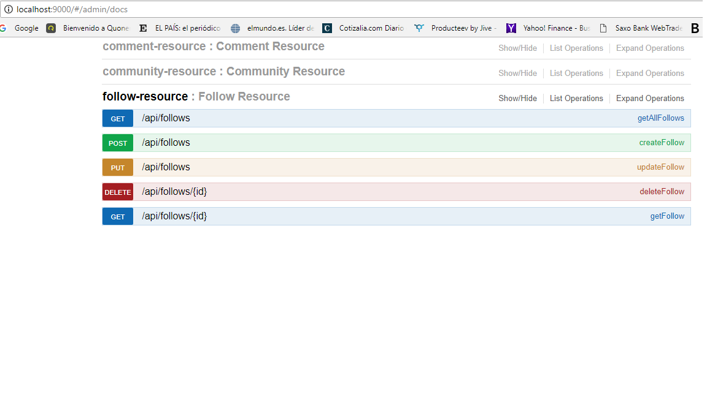
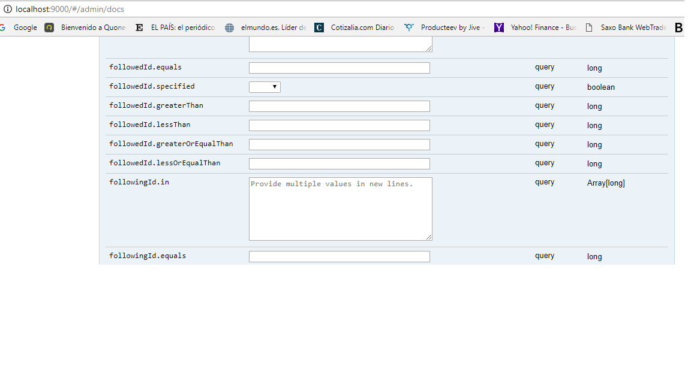

# Problem 3: FILTERING: Show only user’s data:

With the filtering we can make calls using what JHipster offers: the great Swagger!

The getAllFollow method is where you can find all the filter, for example: followedId.equals (long) that filters the Follow records that have a followedId.equals to the one requested

Then we modify the follow.routes.ts and add the route that we are going to use in the calls (almost identical to the one we are already using in the Follows list):

1.- I create a link with the queryParams queryParams: 'profileIdEquals': profile.id in /../src/main/webapp/app/entities/profile/profile-detail.component.html
	
	<a [routerLink]="['/follow']" [queryParams]="{ 'followedIdEquals': profile.id }" class="list-group-item list-group-item-action justify-content-between">

If we need to change the navbar.component.html:

	<a class="dropdown-item" [routerLink]="['/blog']" [queryParams]="{ 'followedIdEquals': profile.id }" routerLinkActive="active" [routerLinkActiveOptions]="{ exact: true }" (click)="collapseNavbar()">
	    <fa-icon [icon]="'asterisk'" [fixedWidth]="true"></fa-icon>
	    Blog
	</a>

2.- We add the route ../src/main/webapp/app/entities/follow/follow.route.ts

	export const followRoute: Routes = [
	    {
	        path: 'follow',
	        component: FollowComponent,
	        resolve: {
	            pagingParams: JhiResolvePagingParams
	        },
	        data: {
	            authorities: ['ROLE_USER'],
	            defaultSort: 'id,asc',
	            pageTitle: 'jhipsterPress06App.follow.home.title'
	        },
	        canActivate: [UserRouteAccessService]
	    },
	    {
	        path: 'follow?followedId.equals=:id',
	        component: FollowComponent,
	        resolve: {
	            pagingParams: JhiResolvePagingParams
	        },
	        data: {
	            authorities: ['ROLE_USER'],
	            defaultSort: 'id,asc',
	            pageTitle: 'jhipsterPress06App.follow.home.title'
	        },
	        canActivate: [UserRouteAccessService]
	    },
	    {
	        path: 'message?profileId.equals=:id',
	        component: MessageComponent,
	        resolve: {
	            pagingParams: JhiResolvePagingParams
	        },
	        data: {
	            authorities: ['ROLE_USER'],
	            defaultSort: 'id,asc',
	            pageTitle: 'jhipsterPress06App.message.home.title'
	        },
	        canActivate: [UserRouteAccessService]
	    },

3.- We add the Params in the /src/main/webapp/app/entities/follow/follow.component.ts

	    constructor(
        private followService: FollowService,
        private parseLinks: JhiParseLinks,
        private jhiAlertService: JhiAlertService,
        private principal: Principal,
        private activatedRoute: ActivatedRoute,
        private router: Router,
        private eventManager: JhiEventManager
    ) {
        this.itemsPerPage = ITEMS_PER_PAGE;
        this.routeData = this.activatedRoute.data.subscribe(data => {
            this.page = data.pagingParams.page;
            this.previousPage = data.pagingParams.page;
            this.reverse = data.pagingParams.ascending;
            this.predicate = data.pagingParams.predicate;
        });
        this.activatedRoute.queryParams.subscribe( params => {
            if (params.followedIdEquals != null) {
                this.nameParamFollows = 'followedId.equals';
                this.valueParamFollows = params.followedIdEquals;
            }
            if (params.followingIdEquals != null) {
                this.nameParamFollows = 'followingId.equals';
                this.valueParamFollows = params.followingIdEquals;
            }
        });
    }
	
4.- We use it in the Query:

    loadAll() {
        const query = {
                page: this.page - 1,
                size: this.itemsPerPage,
                sort: this.sort()
            };
        query[this.nameParamFollows] = this.valueParamFollows;
        this.followService
            .query(query)
            .subscribe(
                (res: HttpResponse<IFollow[]>) => this.paginateFollows(res.body, res.headers),
                (res: HttpErrorResponse) => this.onError(res.message)
            );
    }

We do the same in 

Blog  Community  User 
* Post  Profile  User 
* Message  Community, Profile  User 
* Notification  User 
* BlockedUser  Community  User 
* Community  User  
* Profile  User 
* Album  User 
* Calbum  Community  User

Photo is a more complex example.

The Edit & Delete button have the following filtering:

	<button *ngIf="owner === photo?.calbum?.community?.user?.id || owner === photo?.album?.user?.id || isAdmin == true"

To get the mesages (/webapp/app/entities/photo/photo.component.ts) we have to take to paths:

1) User  Community  Calbum  Photo and 
2) User  Album  Photo. 

The first path starts with a call to myPhotos method that fetchs the Communities that belong to the logged user and then calls communitiesCalbums that fetchs the Calbums for each community calling photoCommunitiesCalbums and bringing the photos that belong to them. 

After that it starts the second path calling myUserAlbums and fetching the Albums of the loggedUser and calling myUserAlbumsPhotos to bring the Photos of each Album.

At this point, both arrays get together: the ones from res.body with the path2 (this.photos). 

